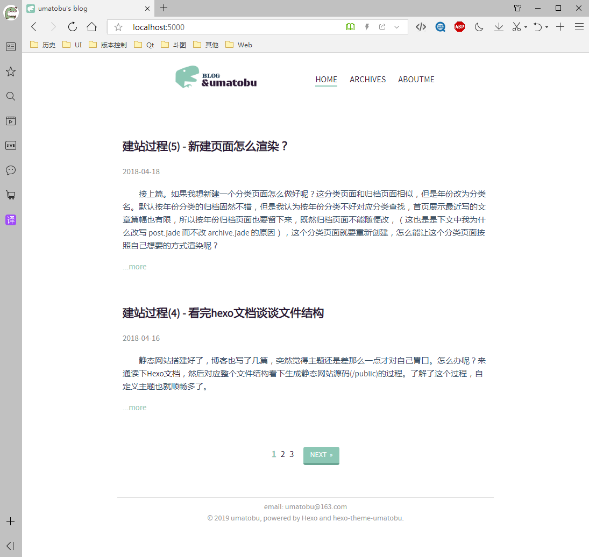
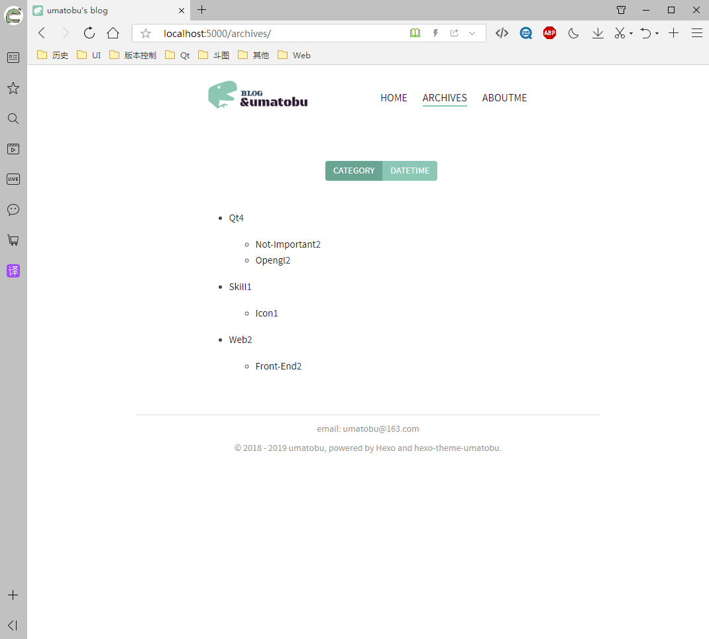

<p align="center"></p>

<div align="center"><a>English</a> | 简体中文</div>

<h2 align="center">UMATOBU - Hexo极简主题</h2>

 
 

## 安装

``` bash
hexo init Blog 
cd Blog 
npm install
hexo new page "aboutme"
git clone https://github.com/umatobu/hexo-theme-umatobu.git themes/umatobu
```

## 启用

修改 `_config.yml` 的 `theme` 配置项为 `umatobu`:

```yaml
theme: umatobu
```

运行命令
``` bash
hexo s
```

浏览器输入地址http://localhost:4000

## 更新

``` bash
cd themes/umatobu 
git pull
```

## License

MIT

## 说明

本主题从[hexo-theme-apollo]("https://github.com/pinggod/hexo-theme-apollo")的基础上改写，模版引擎改为hexo默认安装的引擎，另外首页加了导航，归档页面可按照日期或者分类归档。

aboutme页面暂时还未完成，等待后续更新。