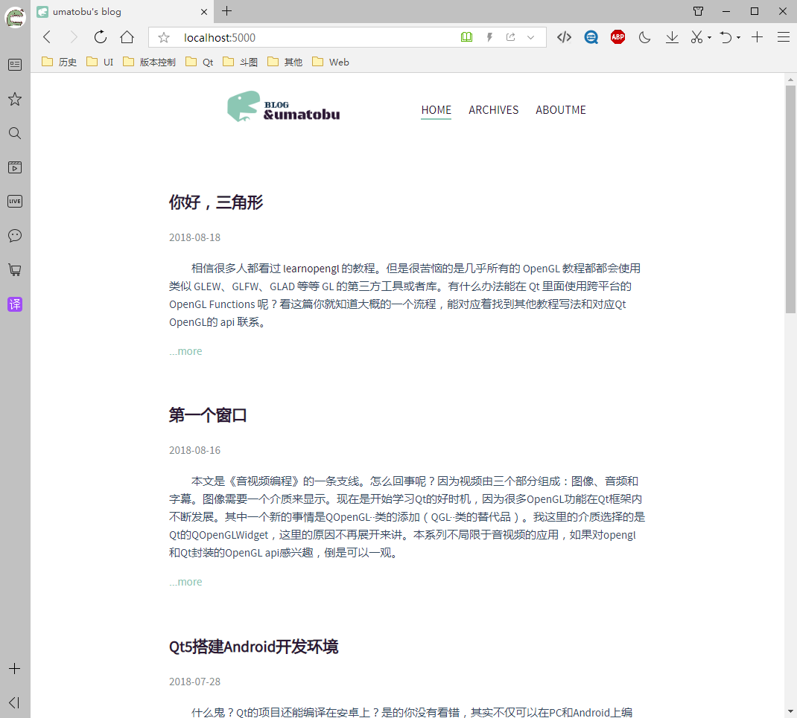

<p align="center"></p>

<div align="center"><a>English</a> | 简体中文</div>

<h2 align="center">UMATOBU - Hexo极简主题</h2>

 
 
 

## 安装

``` bash
hexo init Blog 
cd Blog 
npm install
hexo new page "aboutme"
git clone https://github.com/umatobu/hexo-theme-umatobu.git themes/umatobu
```

## 启用

修改 `_config.yml` 的 `theme` 配置项为 `umatobu`:

```yaml
theme: umatobu
```

运行命令
``` bash
hexo s
```

浏览器输入地址http://localhost:4000

## 更新

``` bash
cd themes/umatobu 
git pull
```

## 格式示例

```
title: Hexo环境搭建
date: 2017-04-15 18:02:14
categories:
- [main_category, minor_category]
```

## 说明

本主题从[hexo-theme-apollo]("https://github.com/pinggod/hexo-theme-apollo")的基础上改写，模版引擎改为hexo默认安装的引擎，另外首页加了导航，归档页面可按照日期或者分类归档。

注意：分类归档只支持两级分类。

aboutme页面暂时还未完成，等待后续更新。

## 分类归档

如果想达到一下效果，可以看我的博客[Hexo自定义辅助函数和插件编写](https://umatobu.github.io/2018/06/19/Hexo%E8%87%AA%E5%AE%9A%E4%B9%89%E8%BE%85%E5%8A%A9%E5%87%BD%E6%95%B0%E5%92%8C%E6%8F%92%E4%BB%B6%E7%BC%96%E5%86%99/)

